# 🚀 AWS Restaurant Application using ALB & Auto Scaling

---

## 📌 Project Overview

This project demonstrates a highly available and scalable restaurant web application architecture deployed on AWS using Application Load Balancer (ALB), Auto Scaling Group (ASG), EC2 instances, and custom VPC networking.

The architecture distributes incoming traffic across multiple EC2 instances and automatically maintains application availability using Auto Scaling.

---

## 🧠 Solution Overview

Built a scalable cloud architecture that allows users to:

* Access restaurant application through a Load Balancer
* Route traffic using path-based routing
* Automatically maintain healthy EC2 instances
* Distribute traffic across multiple servers
* Achieve high availability using Auto Scaling

---

## 🏗️ Architecture

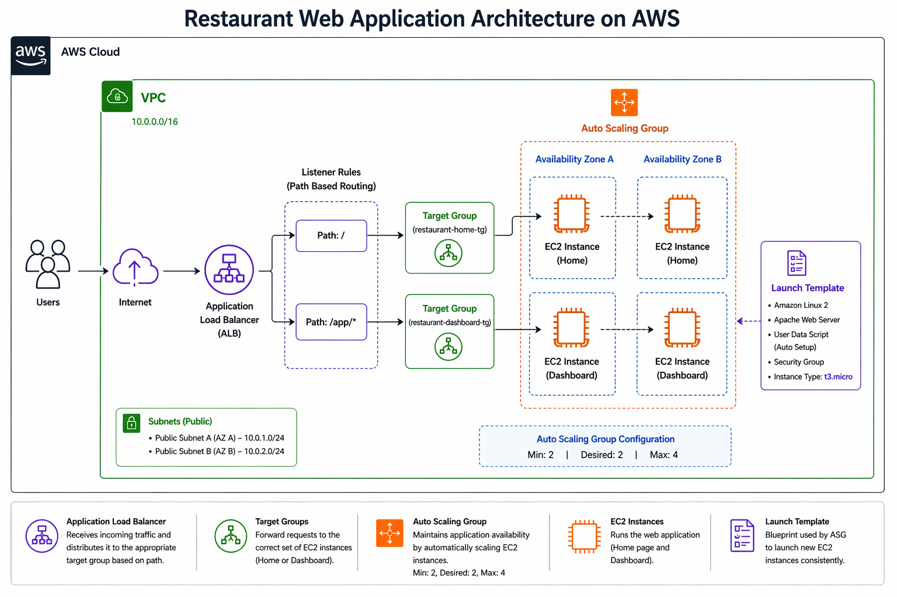

---

## ⚙️ AWS Services Used

* Amazon EC2
* Application Load Balancer (ALB)
* Auto Scaling Group (ASG)
* Target Groups
* Amazon VPC
* Public Subnets
* Route Tables
* Internet Gateway
* Security Groups

---

## 🔧 Implementation Steps

---

### 1. Created Custom VPC

* Created custom VPC:

```plaintext
10.0.0.0/16
```

* Configured isolated network architecture

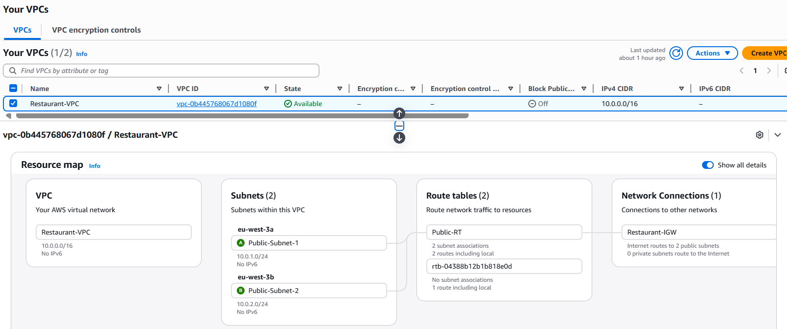

---

### 2. Created Public Subnets

* Created two public subnets across different Availability Zones

```plaintext
10.0.1.0/24
10.0.2.0/24
```

* Enabled auto-assign public IP

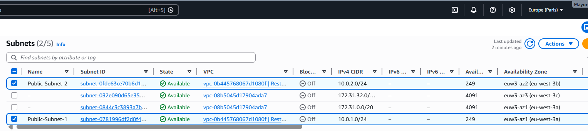

---

### 3. Configured Internet Connectivity

* Created Internet Gateway
* Attached Internet Gateway to VPC
* Configured Route Table for internet access

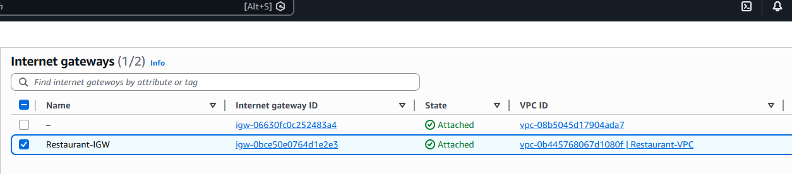

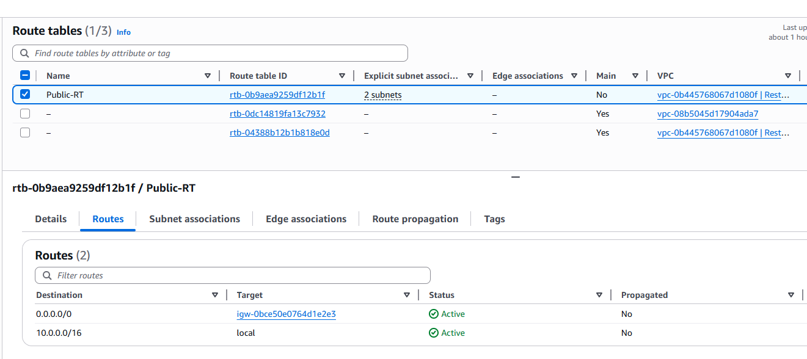

---

### 4. Configured Security Groups

Created separate security groups for:

* Application Load Balancer
* EC2 Instances

Rules configured:

| Service | Port |
|---|---|
| HTTP | 80 |
| SSH | 22 |


---

### 5. Created Launch Template

Configured Launch Template with:

* Amazon Linux 2 AMI
* t3.micro instance type
* Apache web server installation
* User data automation script

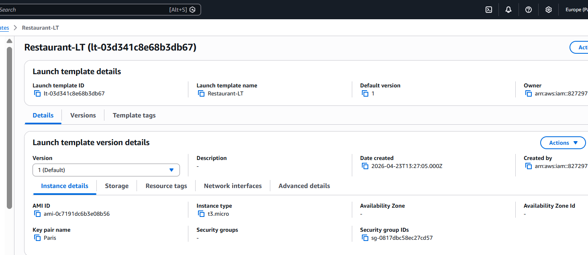

---

### 6. Created Target Groups

Created two target groups:

```plaintext
restaurant-home-tg
restaurant-dashboard-tg
```

Configured health checks for application monitoring.

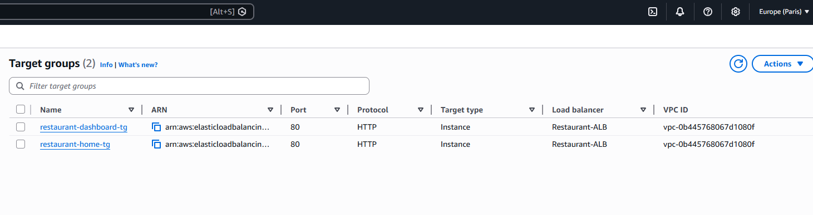

---

### 7. Created Application Load Balancer

Configured internet-facing ALB to:

* Distribute incoming traffic
* Route traffic to healthy instances
* Support path-based routing

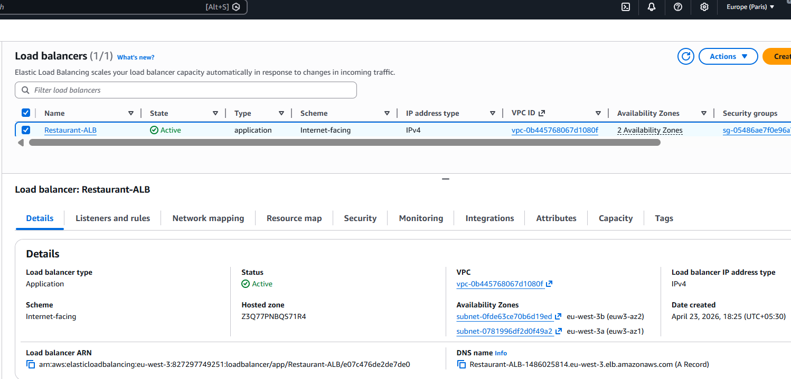

---

### 8. Configured Listener Rules

Implemented path-based routing:

| Path | Target Group |
|---|---|
| `/` | restaurant-home-tg |
| `/app/` | restaurant-dashboard-tg |

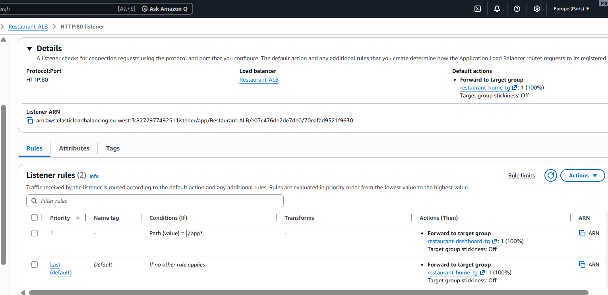

---

### 9. Configured Auto Scaling Group

Created Auto Scaling Group with:

| Setting | Value |
|---|---|
| Minimum Capacity | 2 |
| Desired Capacity | 2 |
| Maximum Capacity | 4 |

This ensures high availability and automatic recovery.

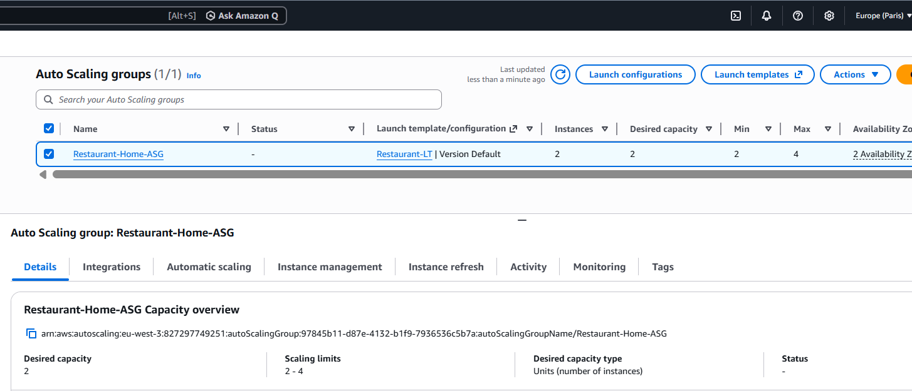

---

### 10. Created Restaurant Dashboard

Built dashboard page accessible through:

```plaintext
/app/
```

Dashboard displays:

* Total Orders
* Active Tables
* Pending Deliveries
* Running Server Information

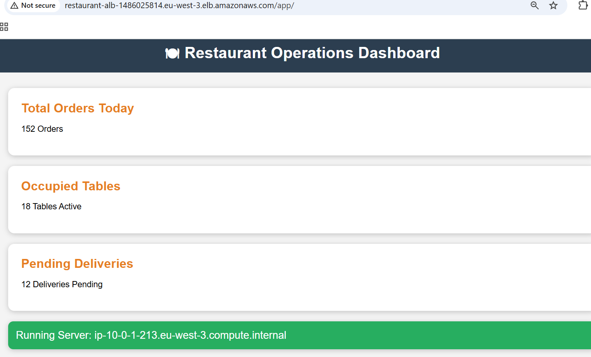

---

## 🧪 Testing

### Homepage

```plaintext
http://ALB-DNS
```

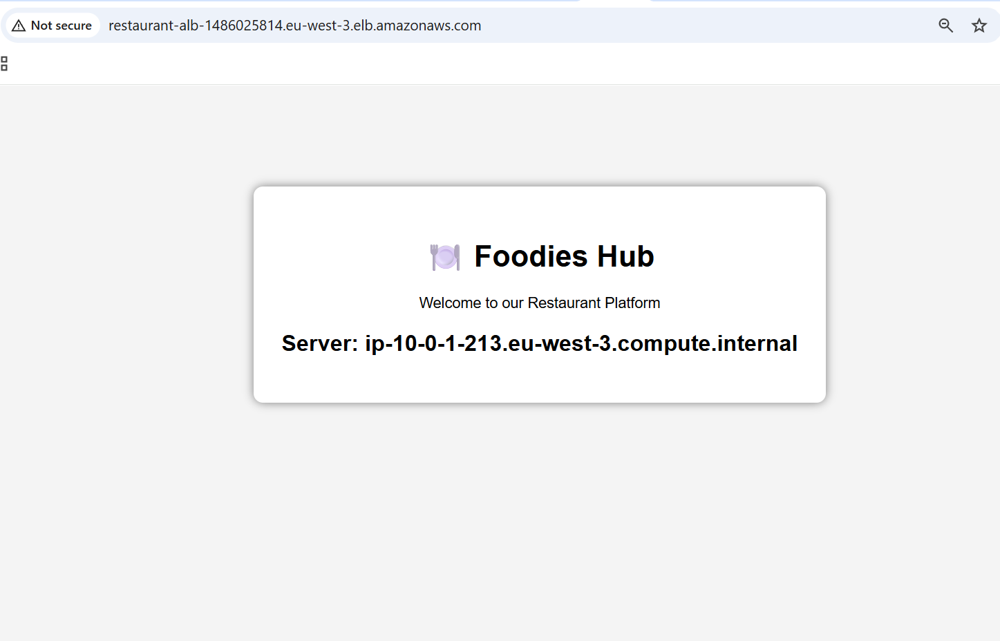

---

### Dashboard

```plaintext
http://ALB-DNS/app/
```

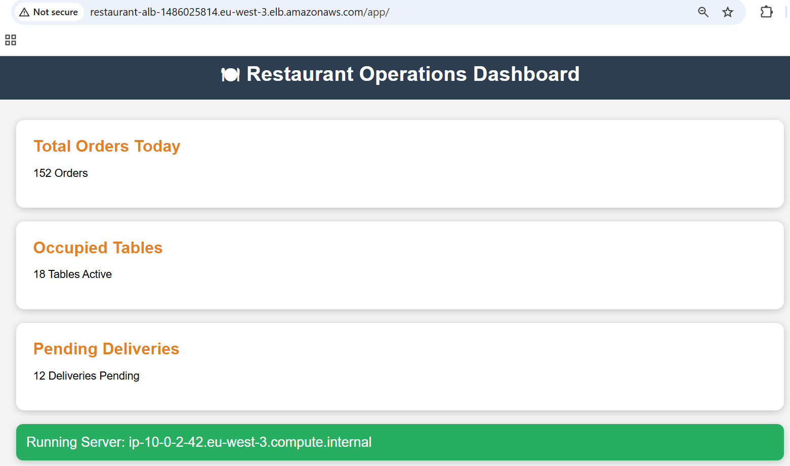

---

## 🔥 How Load Balancer Works

The Application Load Balancer distributes incoming traffic across multiple EC2 instances.

Features:

* Traffic distribution
* Health checks
* Fault tolerance
* Path-based routing

If one instance becomes unhealthy, ALB automatically stops routing traffic to that instance.

---

## 🔥 How Auto Scaling Works

The Auto Scaling Group automatically maintains the required number of EC2 instances.

Configuration:

```plaintext
Minimum = 2
Desired = 2
Maximum = 4
```

Features:

* Automatically replaces failed instances
* Supports scaling during high traffic
* Maintains application availability

---

## 🔐 Security Configuration

Implemented security using:

* Security Groups
* Controlled SSH access
* Restricted HTTP access between ALB and EC2 instances

---

## 💡 Key Learnings

* Designing scalable AWS architecture
* Configuring Application Load Balancer
* Implementing Auto Scaling Groups
* Path-based routing configuration
* Working with Target Groups & Health Checks
* VPC networking setup
* Security Group configuration
* Troubleshooting load balancing issues

---

## 🚀 Future Enhancements

* Add Amazon RDS database
* Add CloudWatch monitoring
* Implement CI/CD pipeline
* Add real-time analytics dashboard

---


